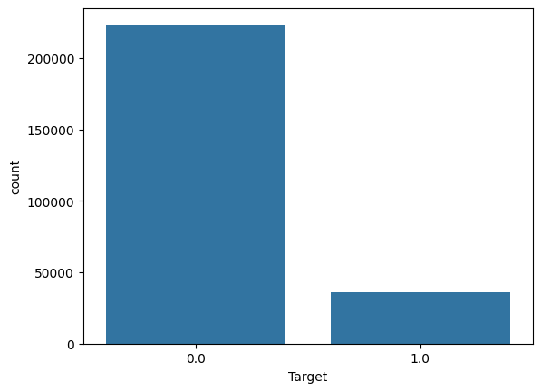
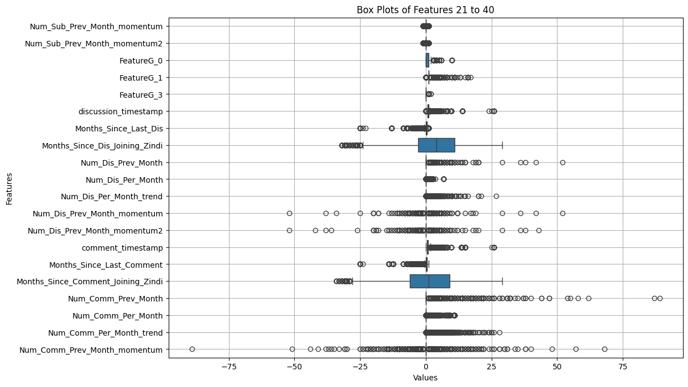
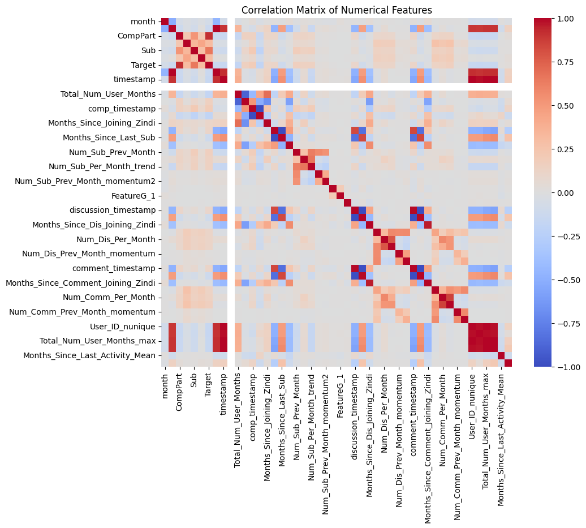
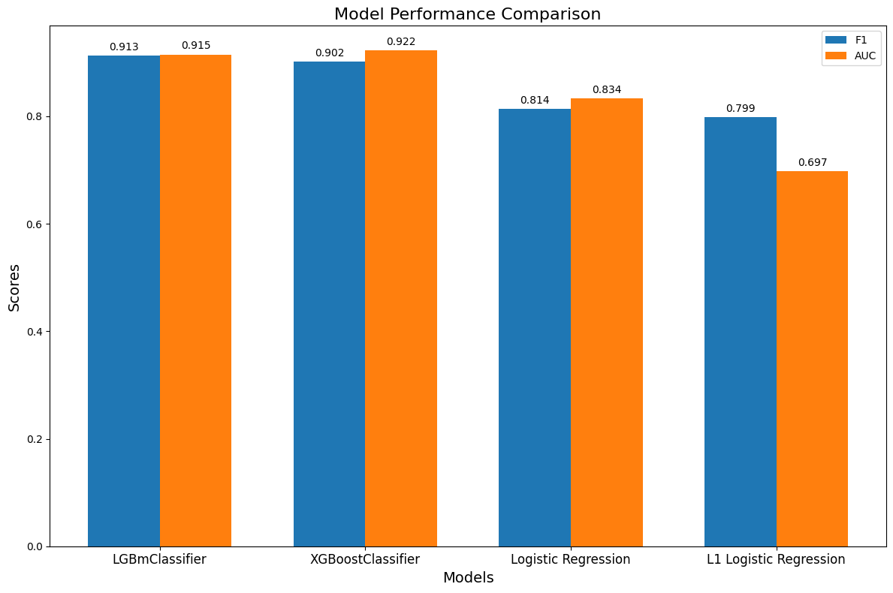

# Intro2DS-ZindiProject

## Task Description  
Problem: Predict if a user will be active on Zindi next month by their participation in competitions, submissions, or forums.
Importance: Helps Zindi enhance user engagement, optimize services, and increase platform efficiency.
ML Contribution: Analyzes user behavior to predict future activity, reducing costs and improving user experience.

## About data

The dataset consists of multiple files detailing hackathons and competitions, user participation, submissions, discussions, and comments, along with metadata explaining each variable. The train and test sets are summarized views of user activity, with the test set requiring predictions for specific users based on month and year, following the format shown in the Sample Submission.

### Main data features and problems
**Class disbalance**  
The "0" class is significantly larger than the "1" class, which can lead to overfitting, challenges in evaluation (since standard accuracy metrics are unsuitable), and longer training times.  
   
  
**Outliers**  
Outliers in the data can increase error rates by affecting the loss function, distort statistics like the mean and standard deviation, and lead to overfitting by capturing noise instead of true patterns. Additionally, the data contains many categorical features and unnecessary information, further complicating analysis.  
  
  
**Correlations**  
Some features show a high correlation with each other, and the target variable is fairly highly correlated with certain features. This suggests potential multicollinearity and key relationships between the target and specific predictors.  
  

## Approach

### Baseline  
The simple and fast model to test some hypothesis/ We use logistic regression, a valuable tool for rapidly assessing hypotheses in binary classification tasks. 

### Advanced approach  
The complex model, that can find deeper connections . We use gradient boostings.

## Results

### Our baseline
| Features            | Precision | Recall | F1 Score | AUC Score |
|---------------------|-----------|--------|----------|-----------|
| CompPart            | 0.966     | 0.983  | 0.974    | 0.833     |
| CompPart, Sub       | 0.998     | 0.998  | 0.997    | 0.976     |
| CompPart                      | 0.966     | 0.983  | 0.974    | 0.833     |
| CompPart, Sub                 | 0.998     | 0.998  | 0.997    | 0.976     |
| CompPart, Sub, Comment        | **0.999**    | **0.999**  | **0.999**   | **0.986**     |
| CompPart, Sub, Comment, Disc  | _1.000     | 1.000  | 1.000    | 1.000     _|

### Advanced approach
Avoided using highly correlated features (e.g., **CompPart = 0.920**), focusing on a broader range of attributes.
Employed grid search and cross-validation for hyperparameter optimization.  

Utilized multiple models:
  1) XGBoost
  2) 2LightGBM
  3) Logistic regression with L2 regularization
  4) Logistic regression with L1 regularization (used for feature extraction)

